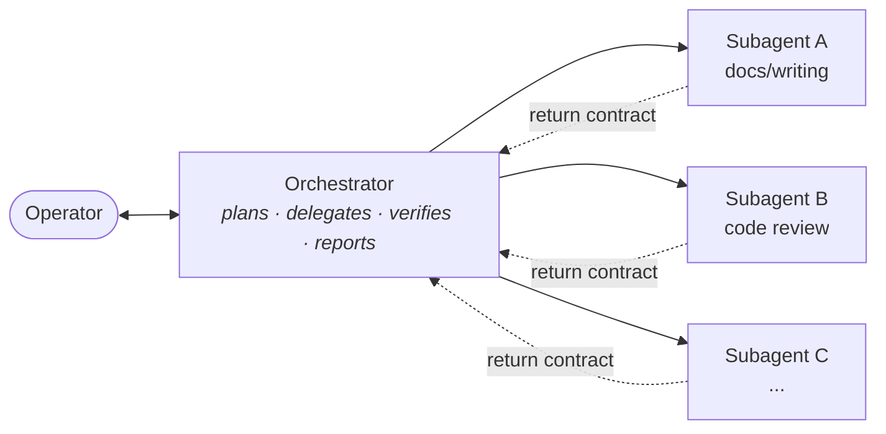

# Architecture

The pattern in full. Nothing here is deployment-specific; every name is a role,
not a person or a host.

**Vocabulary used throughout.** *The operator* — the human whose office this is.
*The orchestrator* — the single coordinating agent the operator talks to.
*A subagent* — a specialist agent the orchestrator calls. *A node* — one unit of
delegated work with exactly one owning subagent and one done-criterion.

---

## 1. The orchestrator / subagent split

One agent coordinates. It does not do the work.



**The orchestrator's surface is documents and configuration — never code.** This
is the single most load-bearing constraint in the pattern, and the least
intuitive. The temptation is constant: the orchestrator has the full context, the
change looks like one line, delegating feels like overhead. Give in and three
things follow within a week:

- Context that should have gone to a specialist stays in the coordinator, so the
  coordinator's window fills with implementation detail and its planning degrades.
- The change skips the specialist's own quality gates — its tests, its linters,
  its conventions — because those live in the subagent's prompt, not the
  orchestrator's.
- Nothing is recorded against an owning agent, so the experience loop
  (§7) never sees it.

Enforce it mechanically if your tool allows it. A pre-write hook that refuses
file writes outside the orchestrator's allowed document paths costs an afternoon
and removes the judgment call entirely.

**Each subagent owns three files:**

| File | Contents | Changes |
| --- | --- | --- |
| `CLAUDE.md` (system prompt) | Role, protocol, hard rules, return contract. | Rarely — it is the agent's constitution. |
| `CONTEXT.md` | Domain facts the agent needs every time: stack, conventions, where things live. | When the domain changes. |
| `SKILLS.md` | Catalogue of the agent's skills with load triggers — which skill, on what symptom. | Whenever a skill is added. |

The split matters. Everything in the system prompt is paid for on **every** turn.
Everything in `SKILLS.md` is a pointer — cheap to carry, loaded only when a
trigger fires. Prompts that grow without bound are the failure mode this
separation exists to prevent: if a lesson can be phrased as "when you see X, do
Y", it is a skill, not a prompt line.

---

## 2. The intake / consolidation gate

Before anything **feature-sized** is delegated, the request gets interrogated
until it is a spec.

**Feature-sized** means any of: two or more subagents doing actual work; more
than roughly half an hour of work; or the operator says some version of "from
scratch". A standing review pass does not count toward the "two agents" test — a
one-line fix that a security agent glances at is still a one-line fix.

**The gate's mechanic — and it is a mechanic, not an attitude:**

1. Ask **one** question. Not a list, not a form. One.
2. Carry your **recommended answer** with it. "Should the export be CSV or JSON?
   I recommend JSON — the consumer is another agent, not a human. Agree?"
3. Wait for the answer. Apply it.
4. Repeat until the next question you would ask has an obvious answer.
5. Emit a **graph of nodes**, not a page of prose.

Why one at a time, with a recommendation attached: a list of eight questions gets
skimmed and answered in a single line that addresses two of them. One question
with a default attached gets either "yes" (fast, and you learned the operator's
preference) or a correction (which is the exact information you were missing).
Ten cheap round-trips beat one expensive misunderstanding.

**What comes out** is a set of imperative nodes:

```text
node-1  [docs-agent]     Draft the API reference for the /export endpoint.
                         Done when: every public parameter documented, examples run.
node-2  [review-agent]   Review node-1 output for factual drift against the source.
                         Done when: zero unverified claims remain.
node-3  [review-agent]   Standing security pass over the diff.
                         Done when: no finding above "informational".
```

Each node: an owning agent, an imperative instruction, a done-criterion that can
be checked without re-deriving the work.

### When the operator is not there

Scheduled runs, overnight jobs, or the operator simply walking away mid-task —
the gate does not stall and it does not guess silently. It:

- writes each open question into the spec **with its recommended answer, marked
  as an assumption**;
- proceeds with everything **reversible**;
- stops at anything **irreversible** and leaves it as a human-reviewable item.

*Irreversible* has a precise test: **the effect cannot be undone by running the
thing again.** Publishing, pushing, sending a message on the operator's behalf,
deleting durable state, installing a capability, writing into a live third-party
system. Reporting to the operator and raising a review item are how the system
reaches the human, so they are never in this class.

---

## 3. Two delegation modes

The line between them is **orchestration complexity, not headcount.**

| | **Normal** (default) | **Batch / workflow** (opt-in) |
| --- | --- | --- |
| Shape | Subagents called one at a time. | One workflow run: fan-out, pipelines, fix-loops. |
| Who holds context | The orchestrator, between every call. | The workflow definition. |
| Adapts mid-run | Yes — the orchestrator reads each result and decides the next call. | Poorly — the graph was fixed at launch. |
| Right when | Anything exploratory, anything where node N+1 depends on what node N found. | Well-specified fan-out: same operation over many independent targets. |
| Cost | Lower; you stop as soon as you have the answer. | Higher; the whole graph runs. |

Three subagents called in sequence, with the orchestrator reading each result
before deciding the next, is **normal mode** — three agents, no workflow. One
agent invoked over twenty files by a workflow definition is **batch mode** — one
agent, real orchestration. Headcount tells you nothing.

Batch mode should be **opt-in by the operator**, and for feature-sized work the
orchestrator should offer it in one line with a rough cost estimate rather than
starting one unasked. Subagents never start workflows of their own — that is how
you get a fan-out you did not authorize and cannot see.

---

## 4. The subagent return contract

Every subagent ends its turn with a fixed-shape block. The orchestrator
**parses** it; it does not read it.

```text
## Result
<2-3 sentence summary>

## Files touched
- path/to/file.ext — created | modified | deleted

## Verification
- check: <what I ran> → pass | fail | skipped (<why>)

## Notes for memory
<1-3 lines worth persisting as agent experience, or "none">

## Open questions
<what I could not decide, or "none">
```

Rules that make it work, each earned:

- **A missing or malformed block means the task is not accepted.** No exceptions
  for short answers, refusals, or read-only turns. An agent that wrote nothing
  says so out loud: `Files touched: none`. The moment one category is exempt, the
  contract stops being parseable and the orchestrator goes back to re-reading
  transcripts.
- **`Verification` carries what was actually run**, with its result. "Looks
  correct" is not a verification. "Tests: 41 passed, exit 0" is. `skipped` is a
  legitimate value when it carries a reason; a silently omitted check is not.
- **`Open questions` is not a courtesy field.** It is where an agent puts a
  decision it was not entitled to make. An empty one on a genuinely ambiguous
  task is a defect.
- **Summary, not dump.** Full output goes to a run log file; the block carries
  the path and the outcome. The orchestrator's context is the scarce resource in
  the whole system.

Contracts differ per agent in what fills `Verification` — a test suite, a build,
a live smoke run — but the **headings and their order are identical office-wide**.
That is what makes them parseable.

---

## 5. Model policy: fixed per agent

Each agent is pinned to one model, chosen by the **role's stakes**, and it does
not change per task.

| Stakes of the role | Bias toward |
| --- | --- |
| A wrong answer is expensive, irreversible, or silently wrong (infrastructure, security, memory quality, architecture) | The strongest model available. |
| Output is structured by skills and cheap to redo (iterative copy, format conversion, reference-driven generation) | A mid-tier model. |
| Coordination itself | The operator's choice — they are in the loop and feel the difference immediately. |

Three properties follow, and all three are the point:

- **No per-task model shopping.** "This one's easy, use the small model" is a
  decision made a hundred times a week, badly, with no feedback signal when it
  goes wrong.
- **Predictable cost.** Spend is a function of *which agents ran*, which you can
  reason about, rather than of a hundred invisible per-task choices.
- **The pin lives in one place — the agent's own definition file.** Prose tables
  (including the one above) are mirrors and will drift. When a table and the
  definition disagree, **the definition is right**; read it with a command and
  fix the table.

**Ban model aliases.** `latest`, `default`, or a bare family name silently change
under you between generations, and you will not notice — the docs will say one
thing while the system runs another for a month. Pin exact identifiers.

Escalation stays manual and visible: an agent that stalls twice on one task gets
re-run on a stronger model, and the orchestrator notes that it did.

---

## 6. Skill portability

A **skill** is a triggered capability: a directory holding instructions the agent
loads when a symptom matches — a checklist, a method, a reference. It is not
prompt text, and that distinction is the whole design.

**One source of truth per skill. Symlinks give each agent only what it needs.**

```text
skills/shared/<bucket>/<skill-name>/     # the one real copy, in version control
agents/<agent>/skills/<skill-name>  ->   # symlink into the library
agents/<agent>/SKILLS.md                 # the catalogue: which skill, on what trigger
```

- **One copy edited once** propagates to every agent that links it. Copy-paste
  distribution guarantees five divergent versions within a month.
- **No agent carries unused capability.** A review agent does not haul a
  documentation-formatting skill it will never open.
- **The binding of skill → agent → trigger moment is deliberate.** Flattening it
  ("all skills available to everyone, the model will pick") is the mistake it
  exists to prevent. The catalogue with its trigger column is the mechanism.

**Exception, and it is a real one:** a skill only one agent could ever use may
live as a real directory inside that agent's own `skills/`, not in the shared
library. Sharing a capability nobody else can act on buys nothing and adds a
symlink to maintain. If another agent later needs it, it asks the owner — that
conversation is the office working, not a gap in it.

**A skill nobody opens is dead.** Trigger phrases in the catalogue must be the
words that actually appear when the situation arises — real symptoms, real error
text — not tidy abstract categories.

---

## 7. Hard rules

A short list that sits **above** all other judgment. Not guidelines. The
orchestrator does not re-litigate them per task, and neither do subagents.

Keep the list short — under ten. Every rule you add dilutes the rest, and a rule
that is sometimes negotiable teaches that all of them are.

1. **The orchestrator never writes code.** Its surface is documents and
   configuration. (§1)
2. **No push, no publish, no visibility change without a separate explicit
   approval for that specific action.** Approval for one action never carries to
   the next. Committing locally is *not* in this class — it is reversible and
   should happen freely; the gate is the push.
3. **Never silently delete durable state.** A conflict becomes a
   human-reviewable item, not a resolution the agent picked.
4. **Never auto-install a capability.** A self-written skill that installs itself
   without human approval is the cleanest self-poisoning path an agent office
   has. Draft, propose, wait.
5. **One writer per store.** Exactly one component may write to any given durable
   store; everyone else submits to an inbox. Two writers to one file is a data-loss
   bug that only shows up under concurrency.
6. **Log every delegated run** to a durable path. An unlogged run cannot be
   audited, debugged, or learned from.
7. **An authorization is citable or it does not exist.** When an agent writes
   "the operator approved this" into anything durable, it carries where and when
   that was said. A line without an address is not a weaker citation — it is not
   a citation, and it must not be written. This one has a useful structural
   property: an unattended run has no conversation to cite, so it *cannot* claim
   authorization at all, and falls back to §2 automatically.

Everything not on this list is judgment, and should be.

---

## Scale: one machine is enough

**This pattern is designed for a solo operator on a single machine.** One
directory tree, one agentic tool, files on local disk, git for history. That is
the baseline, not a stripped-down version of something better.

Splitting across devices or hosts is an **optional scaling step** with exactly
one motivation: something must stay available while the operator's machine is
asleep — a scheduled run, an inbound webhook, an approval queue that should
answer at 3am. If nothing in your office needs to be awake without you, adding a
second host buys you a synchronization problem and nothing else.

When you do split, the constraint that matters is §7 rule 5: **the write path
stays single-writer.** The common shape is an always-on component that queues
work and a single component on the operator's machine that drains the queue and
performs the writes. Two hosts writing the same store is the bug this rule exists
to prevent, and it is unpleasant to diagnose after the fact.

---

## Failure modes, in the order you will meet them

| Symptom | Actual cause | Fix |
| --- | --- | --- |
| The orchestrator "just fixed it quickly" | No mechanical enforcement of §1 | A write-blocking hook, not a stronger prompt |
| Agents deliver plausible work that misses the point | Consolidation gate skipped | Make the gate fire on a *size* test, not on a feeling |
| Orchestrator re-reads transcripts to find out what happened | Return contract drifted or optional | Reject malformed blocks — every time, no exemptions |
| Prompts grow every week | Lessons written as prompt lines | Route recurring lessons to skills (§6) |
| Two agents disagree about a fact | Fact lives in two prompts | One canonical location, others link to it |
| Costs spike unpredictably | Per-task model choice | Pin per agent (§5) |
| A skill exists that nobody ever loads | Trigger phrases are abstract categories | Rewrite triggers as real symptoms and error text |
