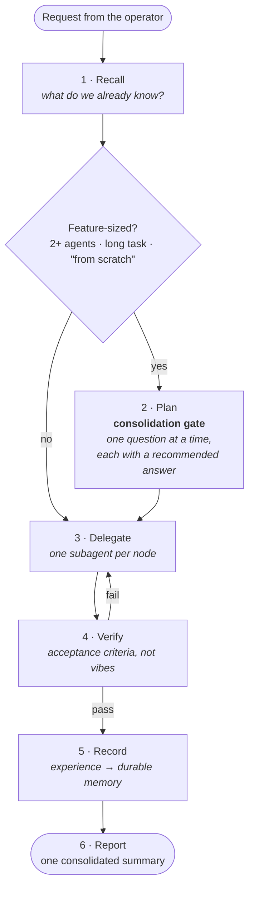

# Agent Office Skeleton

> A pattern for building a multi-agent orchestrator office with Claude Code —
> or any agentic coding tool that can load a system prompt and call subagents.

[](LICENSE)

-lightgrey)

This repository contains **no product code**. It describes a working shape: one
coordinating agent that plans, delegates, verifies and reports, and a set of
specialist subagents that do the actual work. Everything here is generalized —
there are no real names, hosts, or internals from any particular deployment.

## The loop



Six steps, in order, every time:

| Step | What happens | Failure it prevents |
| --- | --- | --- |
| **Recall** | Look up what is already known before asking or assuming. | Re-deciding a settled question. |
| **Plan** | Feature-sized work goes through the consolidation gate first. | Building the wrong thing, confidently. |
| **Delegate** | One subagent per node, each with its own prompt and context. | One giant agent that is mediocre at everything. |
| **Verify** | Run the node's acceptance criteria; a failure goes back named. | "Done" that was never checked. |
| **Record** | Outcomes go somewhere durable, not just into the transcript. | Learning the same lesson monthly. |
| **Report** | One summary: done, skipped, changed, next. | The operator re-reading a 40-step log. |

## Quickstart

1. Read [ARCHITECTURE.md](ARCHITECTURE.md) — what the pieces are and why the
   split is where it is. Fifteen minutes.
2. Open [MANUAL.md](MANUAL.md) — fill-in-the-blank templates for the
   orchestrator prompt, two example subagents, the return contract, and the
   routing table. Paste them into a fresh agent session and answer the blanks.
3. Start with **two** subagents, not twelve. The gate and the return contract
   are what make the pattern work; a large roster is what you grow into.

You do not need a server, a queue, or a database to run this. See
[ARCHITECTURE.md § Scale](ARCHITECTURE.md#scale-one-machine-is-enough) — a solo
operator on one laptop is the supported baseline, not a degraded mode.

## What is *not* here

- No agent implementations, no runtime, no CLI, no dependencies.
- No curated subset of anyone's real agent roster.
- No infrastructure, deployment, or hosting specifics.

Prior art and influences are named in [CREDITS.md](CREDITS.md) — this pattern is
not original in its parts, and it says so up front.

## Repository layout

```text
.
├── README.md                    # you are here
├── ARCHITECTURE.md              # the pattern, explained
├── MANUAL.md                    # paste-ready bootstrap spec
├── CREDITS.md                   # prior art, named
├── LICENSE                      # MIT
└── .github/workflows/lint.yml   # markdown lint only — there is no code to test
```

## License

MIT — see [LICENSE](LICENSE).
